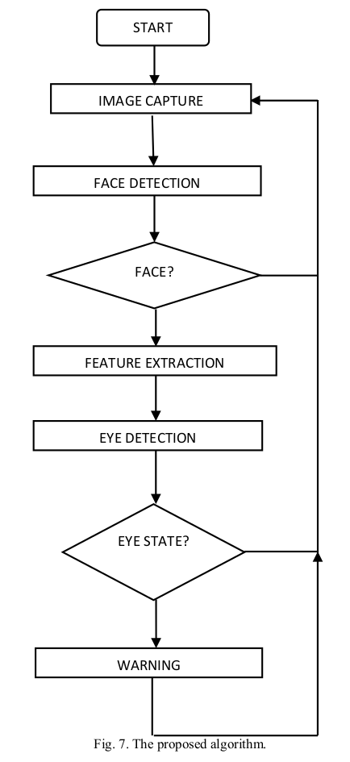
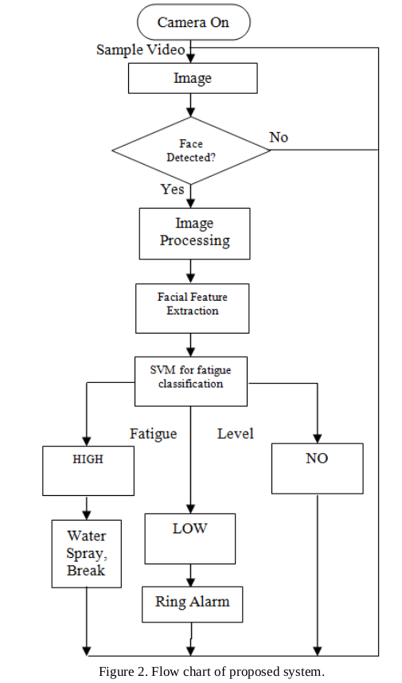
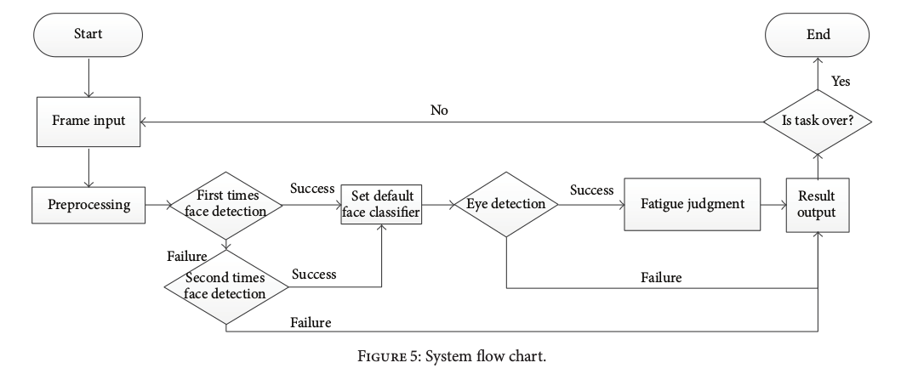
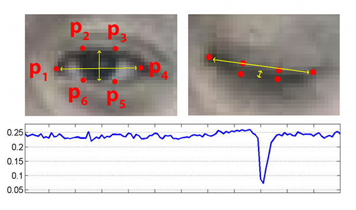

.. note:: This is a review of papers under the subject of *driving fatigue / drowsiness* and *computer vision*.

Efficient Car Alarming System for Fatigue Detection during Driving (2012)
=========================================================================

:author: Muhammad Fahad Khan, Farhan Aadil

Idea
----

The algorithm work in three stages:

1. the face of the driver is detected and tracked.
2. the facial features are extracted for further processing.
3. eye's status is monitored.

---------------------------------------

Technologies Involved
---------------------

- **Face detection** is done by using Viola and Jones algorithm.
- **Eye deetection** is done by using edge detection. "Canny Edge detector", "Sobel Edge detector"
- **Eye Status detection**, intensity change, for example, in eyebrow, upper edge and lower edge of eye.

An Improved Fatigue Detection System Based on Behavioral Characteristics of Driver (2017)
=========================================================================================

:author: Rajat Gupta, Kanishk Aman et al.

Signs / Symptoms of Drowsiness
-------------------------------

- Blinking frequently and partially closed eyes
- Not able to remember the traveled path (ignore)
- Yawning after every small period
- Drifting or move out from the lane (ignore)
- Head nodding
- Poor concentration (ignore for now)
- Slow reactions (ignore for now)

.. note:: This paper focuses on the features related to **eye** and **mouth** like frequent blinking and yawning. 

Idea
----

After getting the face image, it sends to *Support Vector Machine (SVM)* classifier which classifies the facial image as fatigued or not.

Proposed System
---------------

The system consists of three parts.

- Video Capture Unit
- Face Detection Unit and Features Extraction
- Fatigue Detection on Extracted Features

---------------------------------------

A System of Driving Fatigue Detection Based on Machine Vision and Its Application on Smart Device (2014)
=========================================================================================================

:author: Wanzeng Kong, Lingxiao Zhou et al.

.. note:: The method is implemented on smart phones or tablets.

*keywords: machine vision, Adaboost algorithm (face and eye classifier)*

Idea
----

The approach has four steps:

- image preprocessing (denoising)
- face detection
- eye state recognition
- fatigue evaluation

---------------------------------------

Improved Detection Strategy
---------------------------

Front face classifier, left / right-deflected face classifier. 

*For example*, when the system misses the target using the front face classifier, right deflected face classifier is called firstly to re-detect. If it succeeds, the right deflected face classifier will be used in the next frame. 

Fatigue Judgement
-----------------

**PERCLOS** is Percentage of Duration of Closed-Eye State in a specific time interval (1 min or 30 s).

It is a well-recognized and effective measure of neurophysiological fatigue level. In this system, only two eye states: open and closed can be detected. 

PERCLOS is defined as:

---------------------------------------

Hybrid Computer Vision System for Drivers' Eye Recognition and Fatigue Monitoring (2014)
========================================================================================

:author: Alexandra Branza Albu, Ben Widsten et al.

Idea
----

The setup consists of two cameras operating in the visible and near infra-red-spectra, respectively.

.. note:: **NOT** very applicable for our project which only uses a web-cam. Maybe later.

Real-Time Eye Blink Detection using Facial Landmarks (2016)
===========================================================

:author: Tereza Soukupova, Jan Cech et al.

Traditional Methods for Computing Blinks
----------------------------------------

1. Eye localization.
2. Thresholding to find the whites of the eyes.
3. Determining if the "white" region of the eyes disappears for a period of time (indicating a blink).

The Noval, Fancy Detection Method
---------------------------------

The detection is built upon computing a metric called **eye aspect ratio (EAR)**.

Eye Aspect Ratio (EAR) is defined as:

    
.. figure:: images/blink3.png
    :scale: 10 %
    :alt: image
    :align: left
    
.. figure:: images/blink1.jpeg
    :scale: 50 %
    :alt: image
    :align: left
    

    
Eye Blink Detection
-------------------

An SVM classifier is trained to detects eye blinks as a pattern of EAR values in a short temporal window. 

Classification
--------------

- Low value of EAR doesn't necessarily mean a person is blinking. e.g. close eyes intentionally for a longer time, facial expression, yawning etc.
- Training samples: 6 frames before and after an eye is the most closed when blinking.
- For each frame,a 13-dimensional feature is gathered by concatenating the EARs of its neighboring frames.
- The classifier is implemented by a linear SVM trained from manually annotated sequences. 

Accuracy of facial landmark detectors
-------------------------------------

Two state-of-the-art landmark detectors were tested: *Chehra* and *Intraface*.

Conclusion
~~~~~~~~~~

1. For eye landmarks only, *Intraface* is always more precise than *Chehra*. Additionally, the *Intraface* is much more robust to small images.

2. For accuracy of EAR, the error is higher for closed eyes. The reason is that both detectors are more likely to output open eyes in case of a failure.

3. For larger images, the ratio is estimated precisely enough to ensure a reliable eye blink detection.

Eye blink detector evaluation
-----------------------------

The EAR thresholding method lags behind EAR SVN classifiers. 
e.g. The thresholding fails when a subject smiles (narrow eyes) 

